# Chapter 1 — Reliable, Scalable, and Maintainable Applications

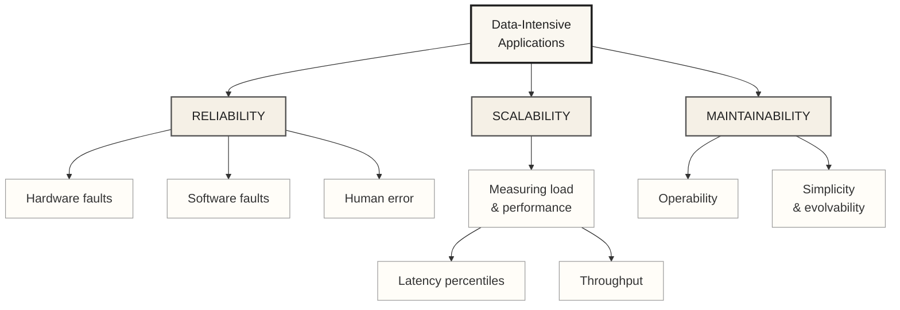

## Reliability

**Definition** — the system continues to work correctly (right function, at the desired level of performance) even in the face of adversity: hardware faults, software faults, and even human error.

**"Working correctly" means four things:**

- **Does what the user expected** — clicking *Pay* charges the card once, not twice.
- **Tolerates users making mistakes** — an emoji pasted into a phone-number field returns "invalid", not a crash.
- **Fast enough under the expected load and data volume** — checkout still answers in under a second on Black Friday.
- **Prevents unauthorized access and abuse** — user A can't read user B's invoice by editing the id in the URL.

**Fault vs. failure** — a *fault* is one component going wrong; a *failure* is the system as a whole stopping. Systems that anticipate faults and cope with them are **fault-tolerant** (or *resilient*).

- *Easy way to remember it:* one engine stops = fault. The plane crashes = failure. Still flying on the other engine = fault tolerance.
- The goal is never "no faults" (impossible) — it's making sure faults don't turn into failures.

> [!CAUTION]
> **Hardware faults** — random, independent physical failures, handled with redundancy.
> *Example: a hard disk crashes — RAID and replicated backups mean the service keeps running unaffected.*

> [!WARNING]
> **Software faults** — systematic bugs that are harder to anticipate because they're correlated across nodes and can cascade.
> *Example: the 2012 leap-second bug made many Linux servers running Java spin at 100% CPU simultaneously worldwide.*

> [!IMPORTANT]
> **Human error** — operators are the least reliable part of the system (config mistakes are a leading cause of outages). Reduce impact by minimizing opportunities for error, decoupling places where people make mistakes from places that cause failures (sandboxes with real data, but no real consequences), testing thoroughly at every level, allowing fast and easy recovery, and setting up detailed monitoring.

**How important is reliability?** — it's a business requirement, not a nice-to-have. Bugs in business applications cause lost productivity, lost revenue, and damage to reputation.

- *Easy way to remember it:* a checkout page that is down earns exactly zero — the outage bills you by the minute.

### Most famous example — Netflix Chaos Monkey

Netflix pioneered deliberately breaking its own production systems to prove they can tolerate it. **Chaos Monkey** randomly terminates live VM instances in production; the wider "Simian Army" goes further, simulating a whole availability-zone outage, network latency spikes, and even config/human-error scenarios — all while real traffic keeps flowing.

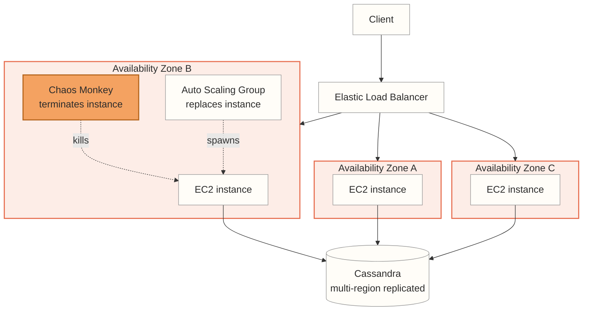

**Where each Reliability point is implemented:**

> [!CAUTION]
> **Hardware faults** → the *Auto Scaling Group* detects the killed instance and spawns a replacement, the *Elastic Load Balancer* routes traffic away from AZ B while it recovers, and *Cassandra's* multi-region replication means no data is lost even if an entire AZ's nodes disappear.

> [!WARNING]
> **Software faults** → instances are stateless and interchangeable, so a wedged process fails its *ELB* health check and is replaced rather than serving errors; keeping the three *AZs* independent stops a bad node from cascading into the rest of the fleet.

> [!IMPORTANT]
> **Human error** → Chaos Monkey turns "an instance disappearing" into a routine, rehearsed event instead of a surprise a human operator would otherwise have to react to at 3am — it's the deliberate, controlled version of the mistake someone will eventually make for real.

## Scalability

**Definition** — scalability is the system's ability to cope with *growth*: in data volume, in traffic volume, or in complexity. It is not a label a system has or hasn't ("this system is scalable") — it's the question *"if the system grows in this particular way, what are our options for coping with that growth?"*

- *Easy way to remember it:* scalability isn't a badge, it's a plan. "We're scalable" means nothing; "we can absorb 10× reads by adding cache replicas" is scalability.

**The three ingredients you need before you can talk about scalability at all:**

- **Load parameters** — the numbers that describe *how much* work arrives (requests/sec, read:write ratio, active users, cache hit rate). Pick the ones that actually stress *your* architecture.
- **Performance metrics** — the numbers that describe *how well* the system copes (p99 response time, throughput).
- **The scalability question itself** — either *"load grows, resources stay fixed: how much does performance suffer?"* or *"load grows: how much must resources grow to keep performance unchanged?"*

> [!NOTE]
> **SLOs and SLAs** — once performance is described as a distribution, you can put a *contract* on it. An **SLO** (service level objective) is the internal target you engineer against — e.g. "p99 response time under 300 ms, 99.9% of requests served". An **SLA** is the customer-facing agreement, usually with money attached: miss it and you refund credits. The SLO is deliberately stricter than the SLA, so you get alerted and fix things *before* the contract breaks.
> *Easy way to remember it:* the SLO is your speed limit, the SLA is the fine you pay if you're caught speeding.

> [!IMPORTANT]
> **Approaches for coping with load** — the practical answer to "how do we keep performance good when load parameters increase?" There is no single right answer: an architecture that scales well is built around assumptions about *which operations will be common and which will be rare* — and those assumptions come from measurement, not from taste.

### What `p99` means — response time as a distribution

**`p99` = the 99th percentile of response time.** Sort every response time in a measurement window from fastest to slowest, then look at the value 99% of the way up the list. `p99 = 120 ms` means: **99% of requests finished in 120 ms or less, and the slowest 1% took longer.** It is a *threshold*, not the time the slow requests took.

The same reading applies to the whole family: **p50** (the *median* — half the requests were faster), **p95**, **p99**, **p999** (the 99.9th percentile — only 1 request in 1,000 was slower).

**Why not just use the average?** Because an average is a single number pretending to describe a crowd. Ten real requests to the ticket-sales API:

| Sorted response times (ms) | 12 | 18 | 25 | 30 | 38 | 42 | 55 | 70 | 240 | 1800 |
|---|---|---|---|---|---|---|---|---|---|---|

- **Mean = 233 ms** — but *not one single user* experienced 233 ms. The number is dragged upward by one outlier and describes nobody.
- **Median (p50) = 40 ms** — this is what a typical user actually feels.
- **The 1800 ms request is a real person** staring at a spinner. The average buried them; the high percentile exposes them.

> [!TIP]
> *Easy way to remember it:* the average is the wrong tool because **nobody is average**. The median tells you about your typical user; p99 tells you about your unhappiest users — and those are the ones who complain, churn, and tweet.

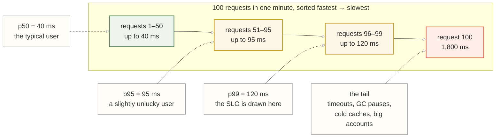

**Why the tail matters far more than "1% of requests" sounds:**

> [!IMPORTANT]
> **1% is not 1% of users.** At `5,000 req/s`, a 1% tail is **50 slow requests every second**. And if loading one page makes 100 backend calls, the chance that page hits *at least one* p99-slow request is `1 − 0.99¹⁰⁰ ≈ 63%`. The tail latency of your backend becomes the *typical* latency of your page.

> [!CAUTION]
> **The slowest requests are often your most valuable customers.** Tail latency usually correlates with having *more data* — the account with the most orders, the largest cart, the busiest event. Amazon famously tracks **p999** for exactly this reason: the customers who make the service slow are the customers who made the most purchases.

> [!WARNING]
> **You cannot average percentiles.** Two servers at `p99 = 100 ms` do not combine into a fleet `p99 = 100 ms` — percentiles must be computed from the merged distribution (which is why monitoring tools store histograms, not pre-computed percentiles). "Average p99" is a meaningless number, and reporting one is a common real-world mistake.

**Practical notes when setting an SLO on p99:**

- **A percentile needs a window** — "p99 = 120 ms" is always *per window* (per minute, per hour). Widen the window and brief spikes vanish; narrow it and it gets noisy.
- **You need enough samples** — p99 needs ≥ 100 requests in the window to mean anything, p999 needs ≥ 1,000. Below that you're reading the max, not a percentile.
- **Higher percentiles cost more to defend** — p99 is usually the sweet spot; chasing p999 or p9999 means fighting GC pauses, TCP retransmits, and disk hiccups, and the book notes it's often too expensive to be worth it.

### Simple example — a ticket-sales API with a p99 SLO

One service, one SLO, one growing load parameter. Nothing distributed yet — just the loop you actually run in practice.

- **SLO** = *Service Level Objective* — the internal performance target the team engineers against ("p99 under 300 ms"). Breaching it triggers work, not a refund.
- **SLA** = *Service Level Agreement* — the signed, customer-facing promise ("99.9% availability") with a penalty attached. Breaching it costs money.
- **SLI** = *Service Level Indicator* — the actual measured number the SLO is set on (the observed p99). The SLI is what you measure, the SLO is the line you draw on it, the SLA is what you owe if you cross it.

**Starting point:** a single API server, `500 req/s`, p99 = 120 ms. SLO says p99 must stay **under 300 ms**. A marketing campaign is about to push traffic to `5,000 req/s` — a 10× increase in one load parameter.

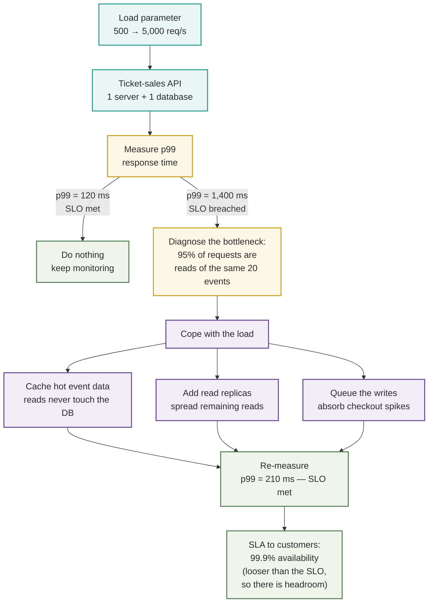

**How to read the diagram:**

- **Load parameter first** — "10× traffic" is meaningless until you know *which* traffic. Here it's reads of a small hot set, which is why caching is the cheap win and sharding would have been wasted effort.
- **The SLO is the decision rule** — p99 = 1,400 ms isn't "slow", it's *a breach*, and that's what authorizes the work. Without an SLO there is no objective moment to act.
- **Coping is chosen per bottleneck** — cache, replicas, and queues each attack a different load parameter (hot reads, total reads, write spikes). You apply the ones your measurements justify.
- **Then close the loop** — re-measure. Scalability work that isn't re-measured is a guess.

> [!NOTE]
> **Measuring load & performance** — load is described with *load parameters* (e.g. requests per second, ratio of reads to writes, number of concurrently active users). Performance is then examined by asking either "if load increases and resources stay fixed, how does performance suffer?" or "how much do resources need to grow to keep performance unchanged?"

> [!TIP]
> **Latency percentiles** — response time should be treated as a *distribution* of values, not a single number. Percentiles (median/p50, p95, p99, p999) reveal what a typical vs. a worst-case user experiences; high percentiles ("tail latencies") matter because they're often felt by the customers with the most data or highest-value requests.

> [!IMPORTANT]
> **Throughput** — the number of records or requests the system can process per unit time; typically the metric that matters most for batch-processing systems, as opposed to response time for online systems.

### Two ways to cope with load — scaling up vs. scaling out

Once an SLO is breached, there are only two fundamental directions to go: make **one machine bigger**, or use **more machines**. Most real architectures use a pragmatic mixture of both.

#### Scaling up (vertical scaling) — one bigger machine

Move the same workload onto a more powerful machine: more CPU cores, more RAM, faster NVMe disks. The architecture doesn't change at all — you keep one node and one copy of the data.

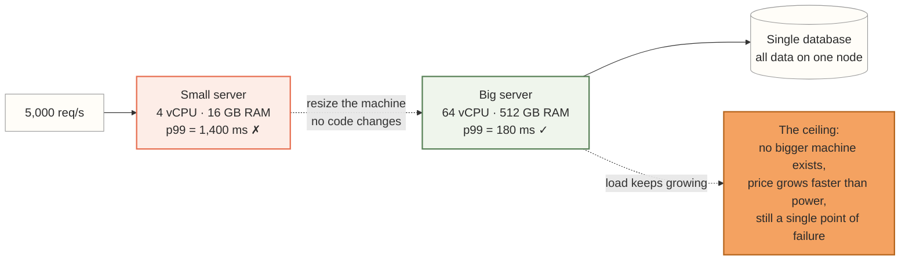

> [!TIP]
> **Why reach for it first** — it's *dramatically* simpler. No distributed transactions, no data partitioning, no consistency puzzles, no code changes; often just a restart on a bigger instance type. A single machine today can have hundreds of cores and terabytes of RAM, which is enough for a surprising number of "big data" workloads.

> [!CAUTION]
> **Where it stops** — three hard limits: (1) there is a **largest machine that exists**, and you eventually reach it; (2) **cost grows super-linearly** — the top-end machine costs far more than 2× a mid-range one for 2× the power; (3) it remains a **single point of failure** — one machine down is the whole service down, so scaling up alone never buys you reliability.

#### Scaling out (horizontal scaling) — many smaller machines

Distribute the load across multiple commodity machines. When those machines share nothing — no shared memory, no shared disk, coordinating only over the network — it's called a **shared-nothing architecture**.

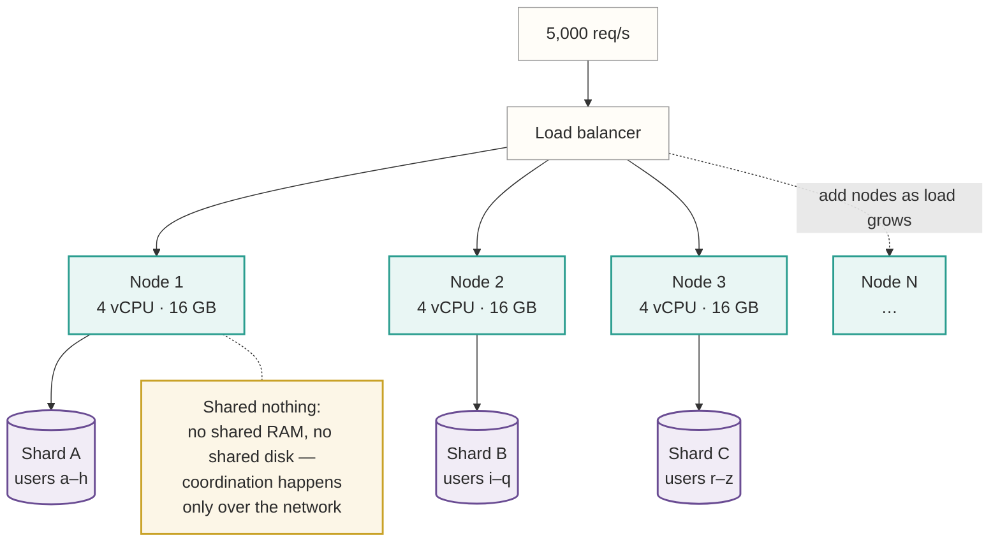

> [!TIP]
> **Why it wins at scale** — capacity grows by *adding* machines rather than replacing one, cost stays roughly linear (commodity hardware), and losing one node degrades the system instead of killing it. This is the only path once a workload genuinely exceeds a single machine.

> [!WARNING]
> **What it costs you** — complexity moves into the application: how do you partition the data, what happens to a query that spans shards, how do you keep replicas consistent, how do you handle a node that is slow rather than dead? Stateless services scale out almost for free; **stateful** systems (databases) are where the real difficulty lives.

- *Easy way to remember it:* **scaling up** = a bigger truck. **Scaling out** = more trucks. One bigger truck is easier to drive; you only start managing a fleet when no truck is big enough.

> [!IMPORTANT]
> **The pragmatic mix** — the choice is not ideological. Scale *up* until the machine, the price, or the availability requirement says stop; scale *out* for the parts that must survive failure or genuinely exceed one box. Elastic systems add capacity automatically on detected load; manually scaled systems are less surprising and easier to reason about. Kleppmann's own advice: **distribute state only when you have to** — until then, a big single machine is often the cheaper engineering decision.

### There is no "magic scaling sauce"

There is **no one-size-fits-all scalable architecture** — informally, no *magic scaling sauce*. The architecture that scales for one product is often actively wrong for another, because "too much load" can mean completely different things.

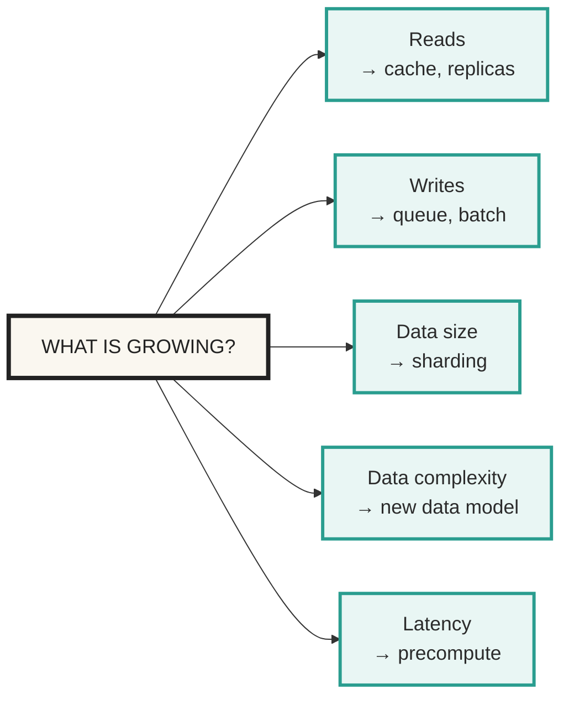

**Each dimension has a different answer — and real systems grow in several at once.** That mixture is exactly why no single architecture fits everyone.

- **A scalable architecture is built from assumptions** about which operations will be common and which will be rare — its *load parameters*. Guess those wrong and the work is wasted at best, harmful at worst.
- **Those assumptions come from measurement**, so early on, keeping the system easy to *change* matters more than making it scalable for a load you don't have yet.
- *Easy way to remember it:* you can't buy scalability off the shelf — you can only scale the specific dimension you measured. Copying Twitter's architecture without Twitter's read:write ratio just buys you Twitter's problems.

### Most famous example — Twitter's home-timeline fan-out

The case study Kleppmann himself uses in the book. Posting a tweet is cheap, but rendering a user's home timeline means merging tweets from everyone they follow. At Twitter's scale — a read:write ratio in the hundreds-to-one, and celebrities with tens of millions of followers — computing that join on every read doesn't scale, so the system needs a deliberate architectural choice about *where* the fan-out work happens.

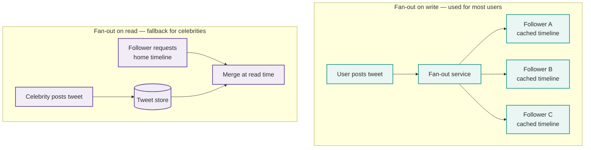

**Where each Scalability point is implemented:**

> [!NOTE]
> **Measuring load & performance** → Twitter picked between the two designs by measuring its actual load parameters (tweets/sec vs. timeline reads/sec) and asking how each design's performance held up as that ratio grew.

> [!IMPORTANT]
> **Throughput** → *fan-out on write* trades write throughput (one tweet becomes millions of timeline-cache writes) for cheap, high-throughput reads (a home-timeline read is just a cache lookup).

> [!TIP]
> **Latency percentiles** → fanning a celebrity's tweet out to tens of millions of followers synchronously would spike p99 write latency for everyone; falling back to *fan-out on read* for high-follower accounts keeps the tail latency bounded across the whole system.

## Maintainability

Over time, many different people will work on the system (engineering and oper‐
ations, both maintaining current behavior and adapting the system to new use
cases), and they should all be able to work on it productively

majority of the cost of software is not in its initial develop‐
ment, but in its ongoing maintenance—fixing bugs, keeping its systems operational,
investigating failures, adapting it to new platforms, modifying it for new use cases,
repaying technical debt, and adding new features.

> [!TIP]
> **Operability** — make it easy for operations teams to keep the system running smoothly: good visibility into system health, straightforward ways to manage the system, and predictable behavior that avoids surprises.

> [!NOTE]
> **Simplicity & evolvability** — *simplicity* means managing complexity through good abstractions so new engineers can understand the system; *evolvability* (agility) means making it easy to modify the system safely as requirements change over time.

### Most famous example — Etsy's continuous deployment

Etsy popularized deploying to production dozens of times a day, paired with **blameless postmortems** (a practice championed by John Allspaw) — treating operability and safe evolvability as first-class engineering concerns instead of an afterthought bolted on after the "real" work is done.

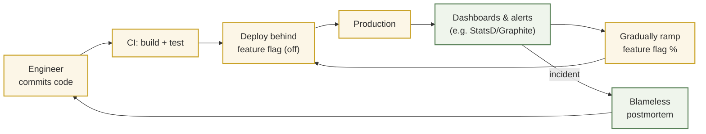

**Where each Maintainability point is implemented:**

> [!TIP]
> **Operability** → *dashboards and alerts* give operators real-time visibility into system health, and the *blameless postmortem* loop turns every incident into a system improvement instead of assigning blame.

> [!NOTE]
> **Simplicity & evolvability** → the *feature flag* decouples deployment from release, so a change can ship to production continuously and be ramped up, down, or rolled back independently — evolving the system safely without a big-bang release.

### A lot of "*bility" can be presented, for instance:

#### Operability: Making Life Easy for Operations

**Definition** — make it easy for operations teams to keep the system running smoothly. Good operations can work around bad software, but good software cannot survive bad operations — so the *system itself* has to be built to be operated.

The book lists what a good operations team is responsible for. The list is long, but it falls into five groups:

> [!NOTE]
> **1. See what is happening — visibility**
> - **Monitor the health of the system** and quickly restore service if it goes into a bad state.
> - **Track down the cause of problems** — failures and degraded performance alike.
> - **Provide visibility into runtime behavior and internals**, with good monitoring.

> [!TIP]
> **2. Stay ahead of problems — be proactive, not reactive**
> - **Keep software and platforms up to date**, including security patches.
> - **Keep tabs on how systems affect each other**, so a problematic change is caught *before* it causes damage.
> - **Anticipate future problems and solve them before they occur** — e.g. capacity planning.
> - **Maintain security as configuration changes are made.**

> [!IMPORTANT]
> **3. Make routine work routine — automation and tooling**
> - **Establish good practices and tools** for deployment and configuration management.
> - **Support automation and integration with standard tools.**
> - **Perform complex maintenance tasks**, such as moving an application to a new platform.
> - **Avoid dependency on individual machines** — a machine can be taken down for maintenance while the system keeps running.

> [!WARNING]
> **4. Be predictable — minimize surprises**
> - **Define processes that make operations predictable** and keep production stable.
> - **Provide good documentation and an easy-to-understand operational model** — *"if I do X, Y will happen."*
> - **Provide good default behavior**, but let administrators override the defaults when needed.
> - **Self-heal where appropriate**, but also give administrators manual control over system state.
> - **Exhibit predictable behavior**, minimizing surprises.

> [!CAUTION]
> **5. Preserve knowledge — outlive the individuals**
> - **Preserve the organization's knowledge about the system**, even as individual people come and go.
> - *Easy way to remember it:* if one engineer going on holiday makes the system unoperable, the knowledge lives in a person, not in the system.

#### Operability example — running an AI Agent Service with Datadog

An AI agent service is a hard operability case: it's **non-deterministic** (the same prompt can produce different output), it **depends on third parties** you don't control (the model provider), its **cost is per-token** rather than per-server, and it can fail *without erroring* — returning a confident, wrong answer with HTTP 200. Classic uptime monitoring sees a perfectly healthy service.

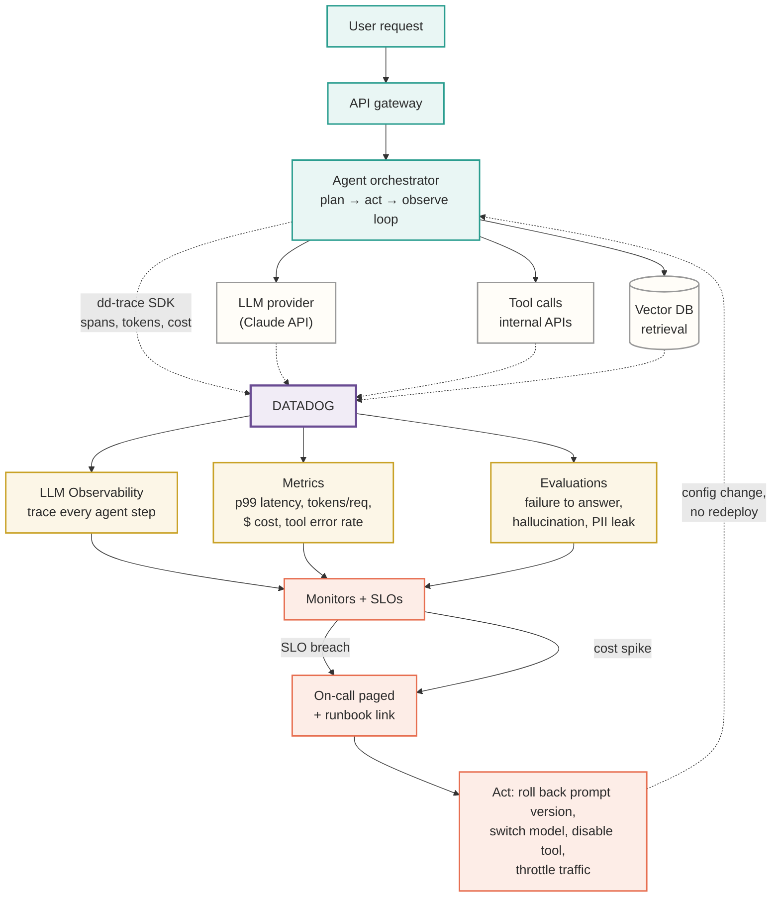

**Where each Operability group is implemented:**

> [!NOTE]
> **1. Visibility** → **LLM Observability traces every step of the agent loop** — which tools it chose, what it retrieved, what the model returned, how many tokens each step burned. Without this, a slow agent is an opaque box; with it, you can see the p99 was spent in a retry against one flaky tool.

> [!TIP]
> **2. Proactive** → **cost and token metrics are capacity planning for AI**: a monitor on `tokens/request` catches a prompt change that quietly tripled spend *before* the invoice arrives. Evaluations and PII/prompt-injection scanning catch quality and security regressions rather than waiting for a user to report them.

> [!IMPORTANT]
> **3. Automation** → the agent, the model provider, the tools, and the vector DB all report to **one place**, so there's no manual correlation across four dashboards during an incident. Instrumentation ships with the deploy; nobody adds monitoring by hand.

> [!WARNING]
> **4. Predictable** → the alert carries a **runbook link**, and the response is a bounded set of **config changes — roll back the prompt version, switch the model, disable a tool, throttle traffic — with no redeploy**. That is the operational model made explicit: *"if I flip this, that happens."* Prompts and model choice are versioned config precisely so a bad one can be reverted in seconds.

> [!CAUTION]
> **5. Knowledge** → dashboards, SLO definitions, and runbooks are the written-down version of "how this agent behaves in production." A new on-call engineer inherits the dashboard, not a Slack thread from six months ago.

- *Easy way to remember it:* for a normal service you monitor **whether it answered**. For an agent service you also have to monitor **whether the answer was any good, and what it cost** — HTTP 200 is not success.

### Simplicity

**Definition** — make it easy for new engineers to understand the system, by removing as much complexity as possible.

Small projects can have delightfully simple and expressive code; as projects grow, they tend to become very complex and difficult to understand. That complexity slows down everyone who works on the system, and the cost compounds.

> [!WARNING]
> **This is *not* simplicity of the user interface.** A system can have a rich, powerful UI and still be simple inside — and a system with three buttons can be a horror internally. Here "simplicity" means *the engineers'* view of the system, not the users'.

#### Symptoms of complexity

Complexity is easier to recognize than to define. The book names the usual symptoms — here each one with a concrete example:

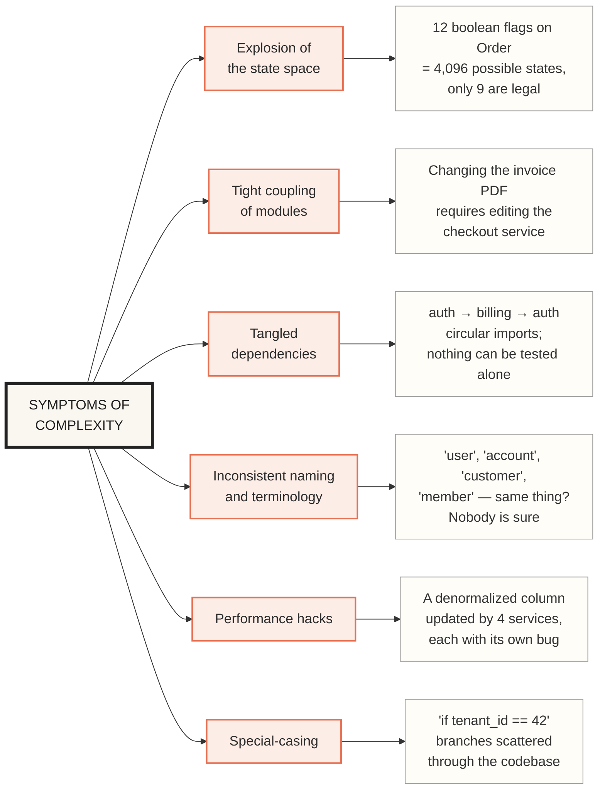

#### Why complexity is bad

> [!CAUTION]
> - **Budgets and schedules get overrun** — when complexity makes maintenance hard, every estimate is wrong in the same direction.
> - **Changes are more likely to introduce bugs** — a system that's hard to reason about hides *unintended consequences*.
> - **Hidden assumptions get overlooked** — the invariant nobody wrote down is the one your change breaks.
> - **Unexpected interactions surface in production** — modules affect each other in ways no single engineer can hold in their head.
> - **Therefore: reducing complexity directly improves maintainability**, which is why simplicity should be a key goal of the systems we build — not a cleanup task for later.

#### Accidental vs. inherent complexity

Making a system simpler **does not mean reducing its functionality** — it usually means removing *accidental* complexity.

- **Inherent complexity** — complexity that comes from the problem itself, as seen by the users. Tax rules really are that complicated; you cannot delete them.
- **Accidental complexity** (Moseley & Marks) — complexity that is **not inherent in the problem** the software solves, but **arises only from the implementation**. This is the complexity you are allowed to delete.

- *Easy way to remember it:* inherent complexity is the mountain; accidental complexity is the backpack full of rocks *you* packed. You can't move the mountain — you can absolutely drop the rocks.

#### Abstraction — the main tool against accidental complexity

**Abstraction hides a great deal of implementation detail behind a clean, simple-to-understand façade.** A good abstraction can also be reused across very different applications — which is more efficient than reimplementing it each time, *and* produces higher-quality software, because every improvement inside the abstraction benefits every application built on top of it.

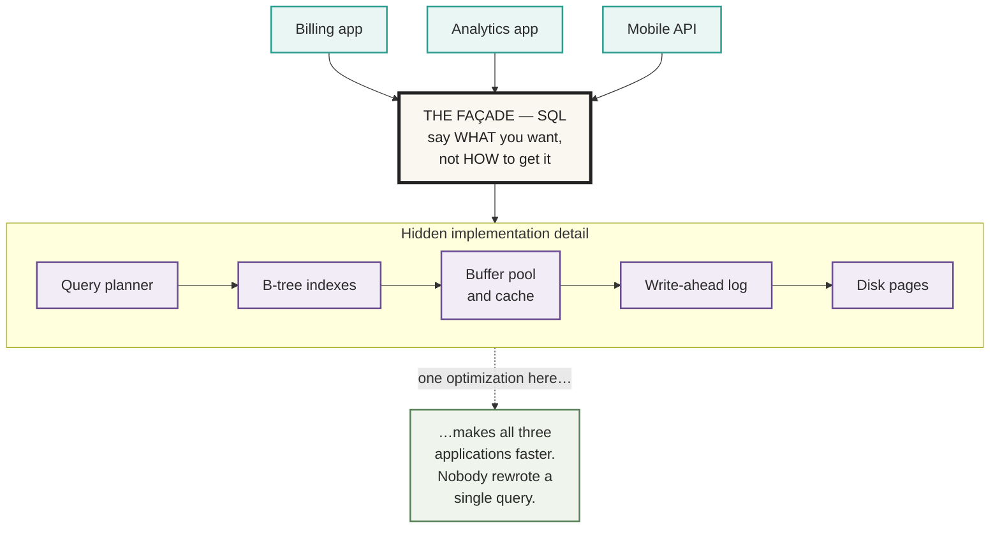

> [!TIP]
> **Why this works** — three applications share *one* battle-tested implementation instead of three homegrown ones. Fixing a bug or landing an optimization in the planner improves all of them at once. That's the leverage abstraction gives you: **quality improvements in the abstracted component benefit every application that uses it.**

- Other examples of the same move: a **programming language** hides CPU registers and machine code; **TCP** hides packet loss and reordering behind a reliable stream; a **container runtime** hides OS and kernel differences.
- The goal isn't zero complexity — it's **finding good abstractions that keep the system's complexity at a manageable level**.

### Evolvability

**Definition** — make it easy for engineers to change the system in the future, adapting it for **unanticipated** use cases as requirements change. Also known as *extensibility*, *modifiability*, or *plasticity*.

- Requirements almost never stand still: you learn new facts, discover new use cases, business priorities shift, users request features, platforms get replaced, legal and regulatory requirements change.
- **Simplicity and good abstractions are what make a system evolvable** — a system you can understand is a system you can safely change. This is why simplicity is not just aesthetics: it's the precondition for evolvability.
- *Easy way to remember it:* **operability** is about running it today, **simplicity** is about understanding it today, **evolvability** is about still being able to change it in two years.

# TODO:

## STAR

**Situation:** hard to combine tools when you need to do something that a single tool cannot do alone.

**Task:** explore what different tools have in common, what distinguishes them, and how they achieve their characteristics.

**Action:** reliable, scalable, and maintainable data systems.

**Result:** data-intensive application.