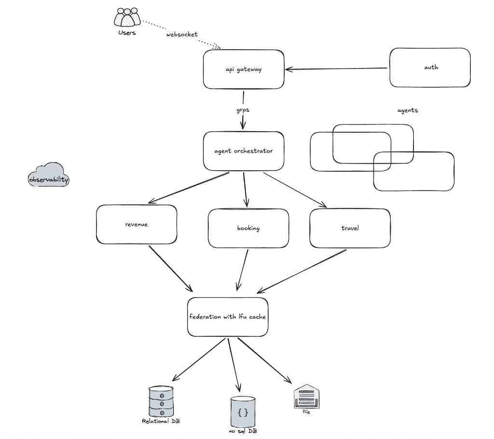

# Agentic Travel Data Platform — Architecture Design

Mock solution for [`mock/agentic_system/agentic_travel_data_platform.ipynb`](../agentic_system/agentic_travel_data_platform.ipynb).

Author: Ivan Zhuravel

## 1. Problem in one sentence

A natural-language interface on top of ~50 business services, on top of
federated data sources (Postgres / NoSQL / CSV) that must not be merged
into a single database. The platform reads, computes and explains —
it does not execute bookings.

## 2. Assumptions from requirement discovery

- ~50 agencies, ~10k corporate users, peak ~200 concurrent NL sessions.
- First response lines within 2–3 s (hence streaming), full answer ≤ 30 s.
- Read-heavy; must never lose: confirmed travel plans, audit log.
- Freshness: revenue may lag ≤ 15 min; booking statuses near real-time.
- Roles are *data access rights*, not personas: Manager, Revenue
  Manager, Basic User.

Back-of-envelope: 200 concurrent sessions × one multi-step plan each ≈
tens of LLM calls/sec at peak and low hundreds of federated queries/sec —
comfortably a single-region deployment; the scaling problems here are
organizational (50 services, N sources), not raw throughput.

## 3. High-level architecture




Invariant worth saying out loud: **the only road to data is the
federation facade** — neither agents nor business services hold direct
source connections.

## 4. Request path (main flow)

Example: *"Show me revenue about Pace for the last week and prepare a
travel plan based on 20% of my revenue."*

1. **Client ↔ API Gateway, WebSocket.** No REST per constraints; the
   socket stays open for the whole session and carries the streamed
   answer. Gateway authenticates the user (OpenID Connect via Auth
   Service) and attaches a signed token with the user's role.
2. **Agent Orchestrator** resolves intent and builds a plan. A
   multi-part query becomes a multi-step plan with data dependencies:

   ```json
   {
     "steps": [
       {"id": 1, "tool": "revenue.byAgency",
        "args": {"agency": "Pace Travel", "period": "last_week"}},
       {"id": 2, "tool": "llm.generateTravelPlan",
        "args": {"budget": "20% of step[1].total"},
        "depends_on": [1], "type": "generation"}
     ]
   }
   ```

   The plan is validated against the registry schema *before*
   execution — a hallucinated tool or parameter fails fast, gets one
   bounded retry with the validation error fed back, then honest
   degradation.
3. **Service Registry + tool catalog.** Services self-register with an
   LLM-readable description of their operations (tool schemas). Before
   planning, the router retrieves only the catalog entries relevant to
   the query — RAG over the *catalog*, not over business data. Business
   data is always fetched live through federation; the catalog is the
   static corpus retrieval was made for. Adding service #51 is a
   registration, not an orchestrator code change.
4. **Business Services** (Booking, Revenue, Agency, Travel, …) expose
   gRPC APIs. Business logic only; no direct database connections.
5. **Federation Layer** — the single road to data. A facade translating
   the platform's unified query format into per-source dialects via
   pluggable adapters (Postgres, NoSQL, CSV/file). Query pushdown by
   default: computation happens at the source; the platform stores
   nothing permanently.
   - **Cache:** TTL derived from the freshness SLA (revenue → 15 min;
     booking statuses → seconds or bypass). Eviction (LRU/LFU) sized by
     memory. TTL answers "how fresh", eviction answers "how big" — two
     separate concerns.

## 5. Streaming (reverse path)

The orchestrator pushes three kinds of events into the client socket:

```text
{"type": "status",     "text": "Querying Revenue for Pace Travel…"}
{"type": "token",      "text": "Your revenue for last week is €"}
{"type": "token",      "text": "12,400. Based on 20% (€2,480)…"}
{"type": "provenance", "items": [...], "confidence": "grounded"}
```

- **status** — plan progress, starts flowing immediately (satisfies the
  2–3 s first-line SLA even when sources are slow);
- **token** — the final LLM text as it is generated, line by line;
- **provenance** — the evidence block at the end (see §7).

Partial failure → stream what succeeded plus an explicit note about the
unavailable source ("Travel data is unavailable right now; here is the
revenue part"). No spinner-until-done long polling.

## 6. Security & authorization — three layers (defense in depth)

1. **Gateway:** authentication; role and user id in a signed token.
   Every downstream hop receives this token — data queries execute
   *on behalf of the user*, never as a privileged platform account.
2. **Orchestrator:** tool scoping by role. A Basic User's agent is not
   even given Revenue tools; the forbidden action is unrepresentable.
3. **Federation:** row/column-level filters derived from the token,
   compiled into every query.

**Why the LLM cannot leak forbidden data:** context minimization.
Filtering happens *before* data reaches the model, so restricted rows
never enter the context window. We do not rely on output filtering —
a model can paraphrase; it cannot quote what it never saw.

**Audit log** (compliance, durable): who asked what, which sources were
touched, what the system answered. Append-only stream to durable
storage; this and confirmed travel plans are the only data the platform
is not allowed to lose.

## 7. XAI / provenance

Provenance is distributed tracing applied to data. During plan
execution the orchestrator accumulates a provenance record: for every
figure in the answer — source system, query issued, timestamp, cache
hit/miss, freshness. For derived values ("20% of my revenue") — the
formula and its inputs. The record is streamed as the final block and
stored with the audit entry.

Confidence levels: deterministic figures from federation are marked
**exact**; LLM-generated text (the travel plan) is marked
**generated-and-grounded**, with each grounding reference listed.

## 8. Session memory & clarification

- Session store keyed by conversation id: resolved entities ("Pace" =
  Pace Travel), clarified parameters. The orchestrator consults it
  before asking the user again (requirement: never re-ask).
- Cross-session user memory (preferences, past trips) — separate
  profile store, fetched deterministically by user id (a lookup, not
  RAG).
- Ambiguous request → clarification question streamed as an event;
  the conversation continues on the same socket.

## 9. Failure handling

- Service/source down → partial result with an explicit gap note.
- Invalid LLM plan → schema validation before execution, one bounded
  retry, then degradation (see §4.2).
- Deadlines propagate via gRPC; the per-request budget (≤30 s) is split
  across plan steps.
- Slow/sick sources: per-adapter connection pools, timeouts and circuit
  breakers in the federation layer, so one agency database cannot
  starve the platform.
- Idempotent reads make retries safe; the platform performs no writes
  to agency systems.

## 10. Scalability to ~50 services

- Self-registration + health checks in the registry; capability
  discovery through the catalog.
- Stateless orchestrator instances behind the gateway scale
  horizontally; session state lives in the session store, not in
  process memory.
- Federation adapters scale per source type.

## 11. Observability

- **Tracing:** trace id is born at the gateway (per WebSocket message),
  propagated orchestrator → services → federation → source adapters
  (OpenTelemetry/Jaeger). LLM calls are spans too.
- **Logs:** collected from all containers, correlated by trace id.
- **Metrics:** liveness/readiness on every container; cache hit rate,
  size, evictions; per-source adapter latency and error rate.
- **LLM-specific:** time to first token, tokens and cost per request,
  plan-validation failure rate, per-stage latency of agent plans.
- **Anomaly detection:** the system is probabilistic — quality drift
  (rising clarification rate, grounding-check failures, cost spikes)
  must alert like any SLO breach. Offline evals on a golden query set
  gate model/prompt changes.
